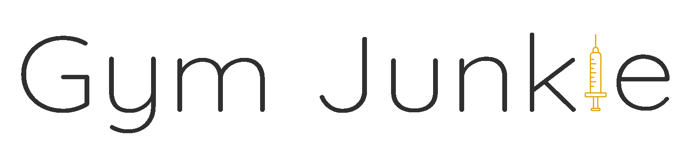

<div style="text-align: center;">
<a name="readme-top"></a>

<br />
<div align="center">
  <a href="https://github.com/othneildrew/Best-README-Template">
    
  </a>
  <h4 align="center">
    Mobile application for tracking your workouts.
    <br />
    <br />
    <a href="https://github.com/eemelimu/GymJunkie/tree/main/Documents"><strong>Documentation</strong></a>
    ·
    <a href="https://github.com/eemelimu/GymJunkie/tree/main/Documents"><strong>ER-Diagram</strong></a>
    <br />
    <br />
  </h4>
</div>
</div>

## What is Gym Junkie?

Gym Junkie is a mobile application for tracking your workouts easily and effortlessy. It is designed to be simple and easy to use for every skill level, whether you are a beginner and new to gym or experiences lifter. You can create your own routines and save them for later use. You can also track your progress and see how you have improved over time.

The application is built using [React Native](https://reactnative.dev/) and [Expo](https://expo.dev/). The [backend](https://github.com/salopietari/gymjunkie-rest-api/tree/main) is built using [Django](https://www.djangoproject.com/).

## How to Use

### Prerequisites

1. You need to have the node with node package manager installed on your machine. If you don't have it installed, you can download it from [here](https://nodejs.org/en/download/).

_To make sure you are using the latest version of npm, run the following command in your terminal:_

```sh
npm install npm@latest -g
```


2.  To view the application on your mobile you need Expo Go app installed on your mobile device. You can download it from [here](https://expo.dev/client), or search _Expo Go_ from your app store.

### Installation

1. Clone the repository
   ```sh
   git clone https://github.com/eemelimu/GymJunkie.git
   ```
   _Instructions for cloning a repository can be found [here](https://docs.github.com/en/repositories/creating-and-managing-repositories/cloning-a-repository)._
   <br>
   <br>
2. Install NPM packages
   ```sh
   npm install
   ```
    <br>
3. Start the application
   ```sh
   npm start
   ```
   To run the app with your mobile device, scan the QR code from terminal with Expo Go app. If you are using an emulator, you can run the app on the emulator by pressing 'a' in the terminal.

### To get the backend up and running, follow the instructions in the [backend repository](https://github.com/salopietari/gymjunkie-rest-api/tree/main).

## Usage

### Creating Goals and Routines
- <Strong>Create Goals:</Strong> Use the app to set personal fitness goals, such as weight loss targets, strength gains, or endurance improvements.
- <Strong>Design Routines:</Strong> Build custom workout routines to fit your goals and schedule. You can create routines for different muscle groups, or for different days of the week.

### Tracking Progress
- <Strong>Log Workouts:</Strong> Record your workouts and track your progress over time. You can log the exercises, sets, reps, and weights used for each workout.
- <Strong>Record Measurements:</Strong> Keep track of your body measurements, such as weight, body fat percentage, and muscle mass. 

### Analyzing Performance
- <Strong>View Statistics:</Strong> View charts and graphs that visualize your progress and performance metrics, making it easy to see how you are improving over time.
- <Strong>Compare Workouts:</Strong> Compare your workouts to see how you are progressing. You can compare your current workout to previous workouts to see how you are improving.

### Sharing Workouts and Achievements
- <Strong>Share Workouts:</Strong> Share your workouts with friends and family, or with your personal trainer. You can also share your workouts on social media to inspire others.
- <Strong>Celebrate Achievements:</Strong> Share your fitness achievements with others, such as reaching a new personal best, or completing a challenging workout.

### Support and Feedback
- <Strong>Connect with Others:</Strong> Access built-in help resources, FAQs, and tutorials to learn more about using the app effectively and overcoming common challenges.
- <Strong>Send Feedback:</Strong> Provide feedback to the app developers to help improve the app and make it more useful for you and others.

### Contribution

- [Pietari Salo](https://github.com/salopietari)
- [Kevin Valle](https://github.com/MMKeke11)
- [Vilppu Tiilkainen](https://github.com/OnlyGIGO)
- [Eemeli Mustonen](https://github.com/eemelimu)